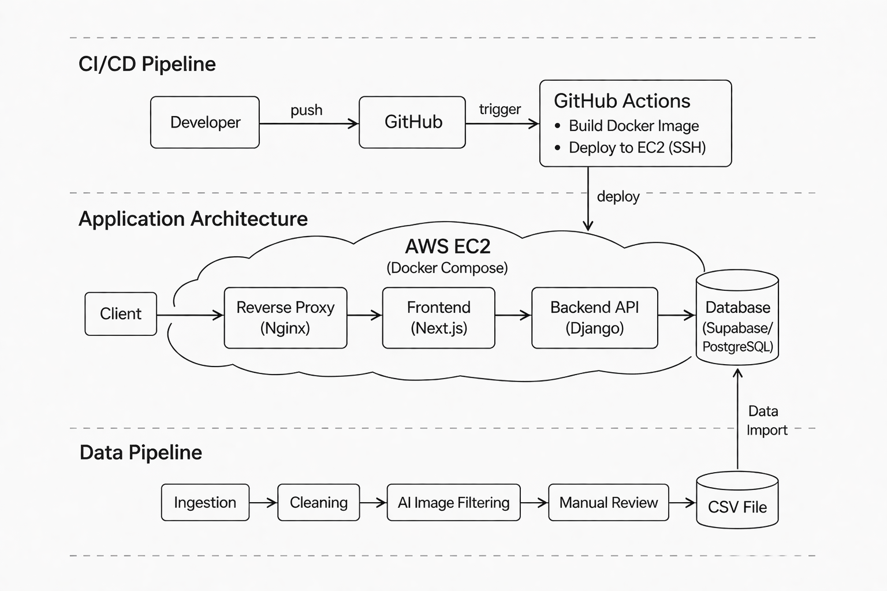

# Hpytra

## 目錄

1. [專案概述](#1-專案概述)
2. [專案架構](#2-專案架構)
3. [系統架構](#3-系統架構)
4. [架構演進](#4-架構演進)
5. [部署與 CI/CD](#5-部署與-cicd)
6. [核心功能](#6-核心功能)
7. [技術重點](#7-技術重點)
8. [專案亮點](#8-專案亮點)
9. [未來優化方向](#9-未來優化方向)

## 1. 專案概述

Hpytra 為旅遊住宿推薦平台，採用前後端分離架構，提供住宿瀏覽、會員系統與收藏功能。系統主要實作後端 API 設計、資料庫建模與查詢邏輯，並透過容器化技術部署於雲端平台，同時整合 CI/CD 自動化部署流程。

另建置住宿資料 data pipeline 與半自動化處理流程，以提升資料建置效率與一致性。

前端展示網站：https://www.hpytra.com/

## 2. 專案架構

```
hpytra/
├── .github/workflows        # CI/CD pipelines
├── hpytra-api               # 後端 API（Django）
├── hpytra-web               # 前端應用（Next.js）
├── hpytra-data-pipeline     # 資料 pipeline（半自動化資料處理）
├── nginx                    # Nginx 設定
├── docker-compose.yml       # 本地開發環境（development）
├── docker-compose.nginx.yml # 本地 Nginx 測試
├── docker-compose.prod.yml  # 正式環境（production）
└── README.md
```

## 3. 系統架構

### 架構圖

<p align="center">
  
</p>

### 系統組成

- Frontend（Next.js）：負責使用者互動與資料呈現，透過 API 與後端溝通
- Backend API（Django）：處理系統邏輯與資料存取，並統一對資料庫操作
- Database（PostgreSQL / Supabase）：作為主要資料儲存層
- Reverse Proxy（Nginx）：統一對外入口並轉發請求至各服務
- Data Pipeline：負責住宿資料抓取、清洗與半自動化處理流程

### 資料流

- Client → Reverse Proxy → Frontend → Backend API → Database

## 4. 架構演進

### Phase 1：初版

- 以單一應用快速完成基本功能

### Phase 2：前後端分離 + PaaS

- 重構為前後端分離架構
- 重整 API 結構與資料查詢邏輯
- 使用 PaaS 進行服務部署：
  - Frontend：Vercel
  - Backend：DigitalOcean App Platform
  - Database：Supabase
- 建立資料建置程式，負責資料抓取、清洗與圖片篩選
- 導入 AI API 提升圖片篩選效率

### Phase 3：Docker + AWS + CI/CD（目前）

- 使用 Docker 統一執行環境
- 部署至 AWS EC2
- 使用 Nginx 作為反向代理
- 建立 GitHub Actions 自動部署流程
- 持續使用 Supabase 作為託管資料庫

## 5. 部署與 CI/CD

### 環境區分

- docker-compose.yml：本地開發環境（development）
- docker-compose.nginx.yml：本地 Nginx 測試
- docker-compose.prod.yml：正式環境（production）

### 部署架構

- AWS EC2 作為應用主機
- 使用 Docker Compose 管理多服務：
  - Frontend（Next.js）
  - Backend（Django API）
  - Reverse Proxy（Nginx）

### CI/CD 流程

- Push code 至 GitHub
- GitHub Actions 觸發 CI/CD 流程
- Build Docker images（由 GitHub Actions 執行）
- 透過 SSH 部署至 AWS EC2
- 重啟服務完成部署

## 6. 核心功能

- 會員登入與身分驗證
- 住宿資料查詢與地圖瀏覽
- 使用者收藏清單管理
- 後台資料管理
- 住宿資料 data pipeline（外部 API 整合與資料清理）
- AI 輔助圖片篩選機制

## 7. 技術重點

### Backend API

- 採用前後端分離架構
- 以 RESTful API 為核心，依資源導向（Place / Hotel / Label）設計系統
- 建立統一 API 回傳格式與全域錯誤處理機制，提升系統一致性與可維護性
- 使用 serializer（類似 DTO）控制回傳資料結構，依不同使用情境設計對應格式，避免 over-fetching
- 將查詢邏輯下推至資料庫層處理，透過 only()、annotate、aggregate 提升查詢效能與擴展性
- 支援透過 query parameters 動態篩選資料，並提供 AND / OR 條件組合查詢
- 實作 JWT + HttpOnly Cookie 驗證機制，降低 XSS 風險
- 整合 Cloudflare Turnstile 進行後端驗證，防止自動化攻擊
- 撰寫單元測試與整合測試，確保核心功能正確性

### Data Pipeline

- 建立住宿資料 data pipeline（抓取 → 清洗 → AI 篩選圖片 → 人工審核 → 入庫）
- 使用 asyncio 建立非同步資料處理流程，提升資料處理效率
- 整合 Google API 與 AI API 進行資料處理與圖片篩選

### DevOps

- 使用 Docker 進行服務容器化（Frontend / Backend / Reverse Proxy）
- 透過 Docker Compose 管理多服務架構，簡化開發與部署流程
- 部署於 AWS EC2，提供穩定的服務運行環境
- 建立 GitHub Actions CI/CD 流程，自動化部署
- 使用 Nginx 作為 Reverse Proxy，統一流量入口並進行請求轉發

## 8. 專案亮點

- 將單一應用重構為前後端分離架構，提升系統可維護性與擴展性
- 導入 Docker + AWS 部署與 CI/CD 流程，建立自動化部署機制，降低人工操作成本
- 針對住宿搜尋與篩選查詢進行優化，透過資料庫查詢優化與動態篩選設計提升查詢效能
- 建立獨立 data pipeline（整合外部 API、AI 與人工審核），並導入非同步處理（asyncio），提升資料建置效率與品質
- 將 AI API 整合至資料處理流程，提升圖片篩選效率並降低人工處理成本

## 9. 未來優化方向

- 建置語意搜尋（向量資料庫），提升住宿搜尋精準度與使用者體驗
- 導入快取機制（如 Redis）優化熱門查詢效能
- 規劃系統拆分（如微服務或模組化），提升系統擴展性
